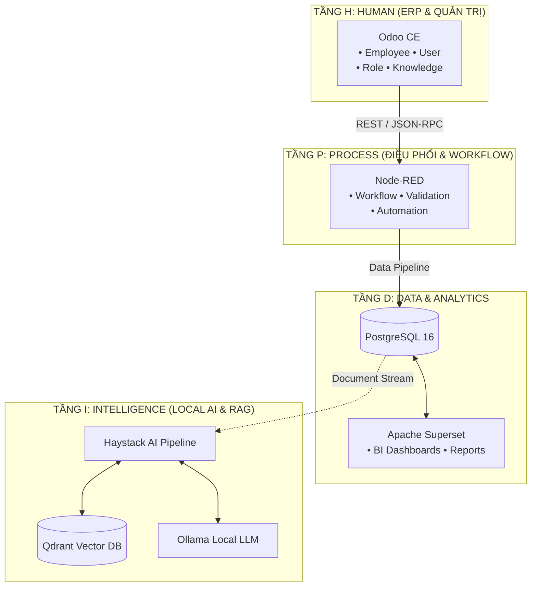

# DX-LAB (DX-OS)

> **Hệ Điều Hành Doanh Nghiệp Số (Digital Transformation Operating System)**  
> Dự án tham dự cuộc thi **Olympic Tin học Sinh viên Việt Nam 2026 - Khối Phần mềm Nguồn mở (PMNM)**  
> **Chủ đề**: *"Xây dựng hệ điều hành doanh nghiệp số (DX-OS)"*  
> **Đơn vị tổ chức**: Hội Tin học Việt Nam & Câu lạc bộ Phần mềm Nguồn mở Việt Nam (VFOSSA)

[](LICENSE)
[](VERSION)
[](BUILD.md)

---

## 1. Giới Thiệu Dự Án

**DX-LAB** là nền tảng hệ điều hành doanh nghiệp số mã nguồn mở toàn diện, kết hợp chặt chẽ giữa quản trị nguồn lực (ERP), tự động hóa quy trình nghiệp vụ (Business Process Automation), phân tích dữ liệu chuyên sâu (Data & BI) và trí tuệ nhân tạo cục bộ (Local AI & RAG).

Hệ thống được thiết kế theo mô hình kiến trúc **H-P-D-I**:
- **H (Human - ERP Layer)**: **Odoo Community** — Quản trị con người, nhân sự (Employee), định danh người dùng (User), phân quyền vai trò (Role) và cổng tri thức doanh nghiệp (Knowledge).
- **P (Process - Automation Layer)**: **Node-RED** — Trung tâm điều phối luồng quy trình (Workflow), kiểm tra tính hợp lệ dữ liệu (Validation) và tự động hóa tác vụ liên hệ thống (Automation).
- **D (Data - Analytics Layer)**: **PostgreSQL & Apache Superset** — Cơ sở dữ liệu quan hệ lõi kết hợp công cụ trực quan hóa dữ liệu mạnh mẽ để cung cấp báo cáo và bảng điều khiển thông minh.
- **I (Intelligence - AI Layer)**: **Qdrant, Haystack & Ollama** — Bộ giải pháp RAG (Retrieval-Augmented Generation) và mô hình ngôn ngữ lớn (Local LLM) vận hành an toàn on-premise, hỗ trợ hỏi đáp nghiệp vụ và tự động hóa tác vụ thông minh.

---

## 2. Sơ Đồ Kiến Trúc H-P-D-I



---

## 3. Cấu Trúc Thư Mục Dự Án

```
DX-LAB/
├── .github/                      # Quy trình CI/CD và mẫu Issue/PR Tracker
│   ├── ISSUE_TEMPLATE/           # Mẫu báo cáo lỗi và đề xuất tính năng
│   └── workflows/ci.yml          # GitHub Actions tự động kiểm thử
├── docs/                         # Tài liệu kỹ thuật chuyên sâu
│   ├── architecture/             # Thuyết minh kiến trúc H-P-D-I
│   ├── api/                      # Tài liệu quy chuẩn API liên tầng
│   └── installation.md           # Hướng dẫn triển khai chi tiết
├── scripts/                      # Kịch bản tự động hóa vận hành
│   ├── setup.sh                  # Khởi tạo môi trường
│   ├── build.sh                  # Biên dịch hệ thống
│   └── release.sh                # Đóng gói bản phát hành (.tar.gz)
├── services/                     # Khung mã nguồn 4 tầng H-P-D-I
│   ├── h_human/                  # Tầng H: Cấu hình và module mở rộng Odoo
│   ├── p_process/                # Tầng P: Luồng điều phối Node-RED
│   ├── d_data/                   # Tầng D: Khởi tạo PostgreSQL và Superset
│   └── i_intelligence/           # Tầng I: Haystack RAG, Qdrant và Ollama
├── .env.example                  # File mẫu biến môi trường
├── BUILD.md                      # Hướng dẫn build & chạy từ mã nguồn
├── CHANGELOG.md                  # Nhật ký thay đổi theo SemVer
├── CONTRIBUTING.md               # Hướng dẫn tham gia đóng góp mã nguồn
├── CODE_OF_CONDUCT.md            # Bộ quy tắc ứng xử cộng đồng
├── DEPENDENCIES.md               # Danh mục gói phụ thuộc & bản quyền
├── docker-compose.yml            # Kịch bản khởi chạy toàn bộ dịch vụ
├── LICENSE                       # Giấy phép OSI-approved (GNU AGPLv3)
├── NOTICE                        # Thông cáo bản quyền và mục đích cấp phép
├── Makefile                      # Lệnh điều khiển chuẩn nguồn mở
└── VERSION                       # Phiên bản hiện tại của dự án
```

---

## 4. Khởi Động Nhanh (Quick Start)

### Bước 1: Chuẩn bị cấu hình
```bash
cp .env.example .env
make setup
```

### Bước 2: Biên dịch và chạy toàn bộ cụm dịch vụ
```bash
make build
make up
```

### Bước 3: Kiểm tra trạng thái
```bash
make status
```

### Cổng Dịch Vụ Mặc Định:
| Tầng | Dịch vụ | Địa chỉ URL | Cổng (Port) |
| :--- | :--- | :--- | :--- |
| **H** | Odoo ERP | http://localhost:8069 | `8069` |
| **P** | Node-RED | http://localhost:1880 | `1880` |
| **D** | Superset BI | http://localhost:8088 | `8088` |
| **D** | PostgreSQL | localhost:5432 | `5432` |
| **I** | Haystack API | http://localhost:8000/docs | `8000` |
| **I** | Qdrant Dashboard | http://localhost:6333/dashboard | `6333` |
| **I** | Ollama API | http://localhost:11434 | `11434` |

---

## 5. Đóng Góp & Phát Triển
Vui lòng đọc kỹ [CONTRIBUTING.md](CONTRIBUTING.md) và [CODE_OF_CONDUCT.md](CODE_OF_CONDUCT.md) trước khi tạo Pull Request.  
Mọi lỗi phát sinh xin tạo báo cáo tại [Issue Tracker](../../issues).

---

## 6. Giấy Phép (License)
Dự án được phát hành theo giấy phép **GNU Affero General Public License v3.0 (AGPL-3.0)**.  
Chi tiết xem tại tệp [LICENSE](LICENSE) và thông cáo bản quyền tại [NOTICE](NOTICE).
