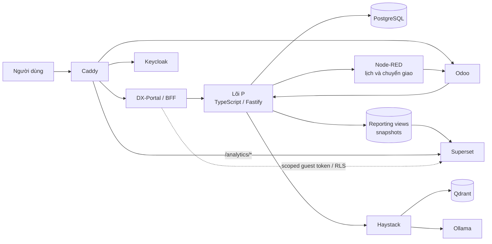

# DX-LAB — Hệ điều hành doanh nghiệp số DX-OS

DX-LAB là dự án phần mềm nguồn mở phục vụ demo OLP 2026. Sản phẩm mô hình hóa hoạt động doanh nghiệp theo chuỗi **H → P → D → I**: con người làm việc trong môi trường số, quy trình tạo dữ liệu có kiểm soát, dữ liệu hỗ trợ điều hành và AI đưa ra đề xuất để con người quyết định.

[](LICENSE)
[](VERSION)

## Trạng thái hiện tại

> **Brownfield skeleton — chưa sẵn sàng để triển khai.** Repository hiện còn cấu trúc thử nghiệm cũ: Node-RED nằm tại `services/p_process`, Compose mở trực tiếp nhiều cổng đặc quyền và `.env.example` chứa giá trị mẫu có thể bị dùng nhầm. Không dùng `make up`, `docker compose up`, `.env.example` hoặc stack hiện tại cho môi trường chia sẻ, demo chấm thi hay production.

Story 1.1–1.2 sẽ chuyển repository sang kiến trúc chuẩn, tạo các profile có thể tái lập và bổ sung lệnh Quick Start sau khi vượt qua clean-host smoke test. Xem [hướng dẫn triển khai](docs/installation.md) để biết ranh giới hiện tại.

## Kiến trúc đích H–P–D–I



### H — Con người

Odoo Community là giao diện làm việc, nhắn tin và duyệt SOP; Keycloak cung cấp danh tính OIDC. Odoo lưu projection tối thiểu và gọi command của P, không sở hữu trạng thái ticket hay SOP.

### P — Quy trình

Lõi TypeScript/Fastify theo kiến trúc lục giác sở hữu toàn bộ bất biến nghiệp vụ: ticket, phân công công bằng, SLA, CSAT, khuyến nghị, phê duyệt và xuất bản SOP. Node-RED chỉ lập lịch và chuyển giao tích hợp; không chứa quy tắc nghiệp vụ và không ghi trực tiếp bảng của P.

### D — Dữ liệu

P sở hữu schema chuẩn, reporting view có phiên bản và snapshot hằng ngày. Superset chỉ đọc dữ liệu báo cáo đã giới hạn phạm vi. Dashboard hiển thị ticket mới, quá SLA, CSAT và các chỉ số vận hành theo quyền người dùng.

### I — Trí tuệ hỗ trợ quyết định

Haystack, Qdrant và Ollama phân loại nội dung, phát hiện nút thắt và soạn bản nháp SOP. AI không tự đổi ticket hoặc xuất bản SOP: nhân viên xác nhận phân loại, người phụ trách rà soát bản nháp và giám đốc quyết định có áp dụng khuyến nghị.

## Luồng demo mục tiêu

1. Người trình diễn mở DX-Portal và giới thiệu tổng quan H→P→D→I.
2. Khách tạo ticket qua Web với email bắt buộc và dữ liệu được kiểm tra.
3. P cấp mã, phân công công bằng và gửi việc tới Odoo.
4. AI đề xuất phân loại; nhân viên xác nhận trước khi loại mới có hiệu lực.
5. Nhân viên xử lý ticket trên Odoo; P theo dõi bước quy trình và SLA.
6. D cập nhật Dashboard; I phát hiện nút thắt, đưa khuyến nghị và soạn bản nháp SOP.
7. Giám đốc quyết định; người phụ trách duyệt SOP trong Odoo trước khi xuất bản.

## Cấu trúc đích rút gọn

Danh sách dưới đây nêu các vùng chính, không thay thế cây đầy đủ trong Architecture Spine. Các đường dẫn đánh dấu “sẽ tạo” chưa tồn tại trong skeleton hiện tại:

```text
apps/web/                    # Sẽ tạo: DX-Portal, form và Dashboard
services/h_human/            # Odoo, addon, OIDC và adapter P
services/p_process/          # Sẽ thay: lõi TypeScript/Fastify
services/p_automation/       # Sẽ tạo: tài sản Node-RED được di chuyển
services/d_data/             # Superset, dataset và dashboard
services/i_intelligence/     # Haystack, Qdrant và Ollama
services/notification/       # Sẽ tạo: SMTP/notification adapter và Mailpit
contracts/openapi/           # Sẽ tạo: hợp đồng REST có phiên bản
contracts/events/            # Sẽ tạo: JSON Schema sự kiện
contracts/reporting/         # Sẽ tạo: dataset, scope key và RLS mapping
contracts/exports/           # Sẽ tạo: schema định dạng mở và từ điển dữ liệu
infra/                       # Sẽ tạo: Compose, Caddy và Keycloak
fixtures/                    # Sẽ tạo: dữ liệu demo và test xác định
docs/                        # Kiến trúc, API và triển khai
```

Kiến trúc đích có ba profile thành phần: `core`, `demo`, `ai`. Tên lệnh và overlay chính xác chỉ được công bố sau khi chúng tồn tại và được kiểm chứng. `dev`, `test` và `demo` là các môi trường tách biệt, không phải tên thay thế cho profile.

## Tài liệu

- [Architecture Spine](_bmad-output/planning-artifacts/architecture/architecture-DX-LAB-2026-09-19/ARCHITECTURE-SPINE.md) — nguồn quyết định kiến trúc ưu tiên.
- [Kiến trúc H–P–D–I](docs/architecture/hpdi_architecture.md) — bản giải thích tiếng Việt.
- [Quy ước API](docs/api/hpdi_api_spec.md) — ranh giới command, sự kiện và tích hợp.
- [Hướng dẫn triển khai](docs/installation.md) — trạng thái skeleton và điều kiện phát hành lệnh cài đặt.
- [BUILD.md](BUILD.md) — tình trạng build hiện tại và cổng chất lượng cần đạt.
- [Technology Sources](_bmad-output/planning-artifacts/architecture/architecture-DX-LAB-2026-09-19/TECHNOLOGY-SOURCES.md) — phiên bản seed và bằng chứng cần khóa.

## Đóng góp

Đọc [CODE_OF_CONDUCT.md](CODE_OF_CONDUCT.md) trước khi đóng góp. [CONTRIBUTING.md](CONTRIBUTING.md) hiện vẫn thuộc skeleton cũ; không làm theo hướng dẫn build hoặc coi Node-RED là nơi sửa quy tắc quy trình trong tài liệu đó cho đến khi Story 1.1–1.2 cập nhật. Hành trình đóng góp chính thức sẽ dùng profile `core` để không yêu cầu tải Odoo, Superset hoặc model AI.

## Giấy phép

DX-LAB được phát hành theo **GNU Affero General Public License v3.0 (AGPL-3.0)**. Xem [LICENSE](LICENSE), [NOTICE](NOTICE) và [DEPENDENCIES.md](DEPENDENCIES.md).
