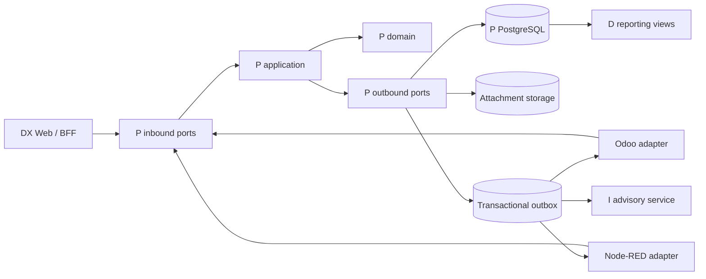
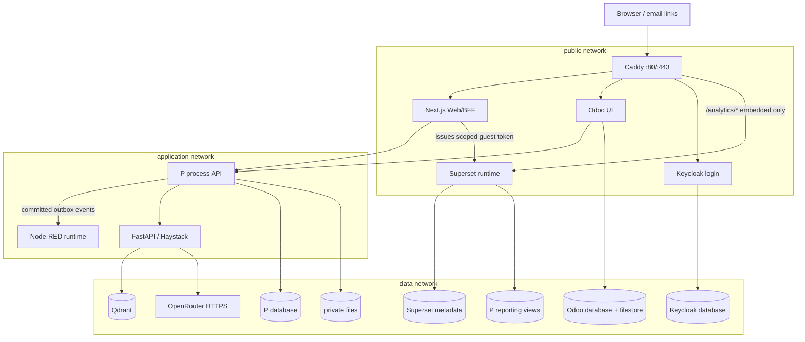
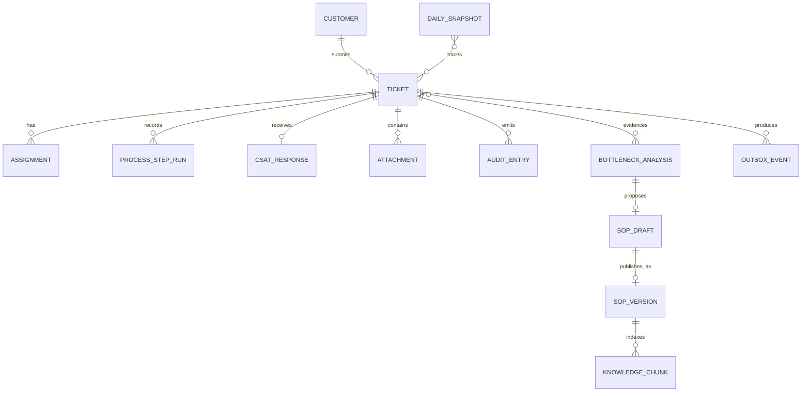

# Architecture Spine — DX-LAB

## Design Paradigm

**Hexagonal Process Core with Event-Driven Integration.** The P-layer domain and application core contains every business invariant. HTTP, PostgreSQL, storage, identity, Odoo, Node-RED, D and I are adapters around that core. Dependencies point inward; integrations react only to committed events.



## Invariants & Rules

### AD-1 — Canonical business state belongs to P [ADOPTED]

- **Binds:** FR-4–FR-12
- **Prevents:** Conflicting assignment, status, SLA, CSAT, approval and audit histories across tools.
- **Rule:** Only P application commands may mutate canonical tickets, assignments, process steps, CSAT, recommendations and SOP lifecycle. Odoo, Web, Node-RED, D and I use P APIs or committed events; none writes P tables directly.

### AD-2 — Domain rules stay inside the hexagonal core [ADOPTED]

- **Binds:** FR-4–FR-8, FR-11–FR-12
- **Prevents:** Different channels implementing different validation, assignment or approval behavior.
- **Rule:** TypeScript domain/application modules own validation, fair assignment, lifecycle transitions, business-time SLA, CSAT and approval rules. Adapters translate protocols and persistence only. Node-RED may schedule and deliver integrations but may not encode domain invariants.

### AD-3 — Commands and events are replay-safe

- **Binds:** FR-3–FR-12
- **Prevents:** Duplicate email, notification, AI analysis or state transition after retries.
- **Rule:** Every create command and retryable side effect requires `Idempotency-Key`; updates to an existing aggregate also require an aggregate version precondition. A successful P transaction writes its integration event to the PostgreSQL outbox atomically. Delivery is at least once; every consumer deduplicates by `event_id`, and failed delivery has bounded retry plus dead-letter state.

### AD-4 — Data ownership is isolated

- **Binds:** FR-2–FR-13
- **Prevents:** Hidden coupling through shared tables and unauthorized cross-system reads.
- **Rule:** One PostgreSQL server may host the demo, but Keycloak, Odoo, P and Superset metadata use separate databases and least-privilege users. P owns canonical schemas and versioned reporting views. Superset gets read-only reporting access, Odoo gets projections, and I gets sanitized DTOs. A component never reads another component's private tables.

### AD-5 — Identity and authorization are centralized [ADOPTED]

- **Binds:** FR-1–FR-3, FR-5–FR-12
- **Prevents:** Email-based identity drift and UI-only access control.
- **Rule:** Keycloak is the single OIDC issuer; immutable `sub` is the actor key and email is an attribute. Browser login uses Authorization Code with PKCE; service calls use client credentials. The BFF cookie contains only an opaque, signed session ID; reusable tokens stay server-side, and cookie-authenticated mutations require CSRF protection. P validates issuer, audience, scopes, role, group and assignment on every resource request. Odoo enforces matching UI groups. Demo role switching uses isolated authenticated browser sessions.

### AD-6 — The Web shell is the browser trust boundary [ADOPTED]

- **Binds:** FR-1–FR-2, FR-4, FR-8–FR-12
- **Prevents:** Tokens and privileged service endpoints leaking into browser code.
- **Rule:** One Next.js BFF serves Portal, H/P landing pages, ticket/CSAT forms and the unified D/I Dashboard. It stores sessions in Secure, HttpOnly, SameSite=Lax cookies. Browsers never connect directly to PostgreSQL, Superset administration, Qdrant, OpenRouter or I. Anonymous intake uses CSRF/origin protection, rate limiting and `Idempotency-Key`; CSAT uses an expiring single-use opaque token bound to one ticket. Ticket codes never grant access.

### AD-7 — Odoo is a work surface and projection [ADOPTED]

- **Binds:** FR-3, FR-5–FR-9, FR-12
- **Prevents:** Odoo becoming a second ticket or SOP authority.
- **Rule:** Odoo stores minimized ticket projections, work items and integration references. Group lists and chat payloads exclude contact data and attachment URLs; detail links resolve through P authorization so only the assignee, authorized leaders and directors see their permitted fields. Odoo actions call P commands and committed P events refresh its projection. Odoo hosts staff chat and SOP review UI; only P records approval and publication. Resources and I consume published SOP versions only.

### AD-8 — AI is advisory and receives minimized data [ADOPTED]

- **Binds:** FR-5, FR-11–FR-12
- **Prevents:** Probabilistic output bypassing deterministic rules, privacy boundaries or human authority.
- **Rule:** A P worker alone evaluates the deterministic `3 tickets / 7 days / >60 business minutes` trigger against P-owned reporting definitions and creates one recommendation per evidence key. D only presents those definitions. I receives only the ticket description for classification, or aggregated/masked evidence and published knowledge for analysis. I may return a typed proposal, explanation or SOP draft through an authenticated idempotent P command; it cannot mutate tickets, publish SOPs, send external messages or decide approval. Store model, prompt, source and output versions with each proposal.

### AD-9 — Attachments are private domain resources [ADOPTED]

- **Binds:** FR-4, FR-9
- **Prevents:** Public file paths, executable uploads and authorization bypass.
- **Rule:** P exposes an attachment-storage port. The demo adapter writes opaque keys outside the web root to a dedicated volume; PostgreSQL stores metadata, SHA-256 checksum, detected media type and size. Only authorized P endpoints upload/download one allowed image or PDF up to 10 MB after extension, signature and size validation. An S3-compatible adapter must preserve the same port.

### AD-10 — Reporting definitions have one owner

- **Binds:** FR-9–FR-11
- **Prevents:** Dashboard, snapshots and AI using different metric definitions.
- **Rule:** P owns versioned SQL reporting views, authorization scope and an idempotent daily snapshot job. Reporting datasets expose immutable `group_id` scope keys and approved metric columns only; their database role cannot read private P tables. Each snapshot stores `as_of`, data period, group scope, metric-definition version and source ticket/event trace. Superset visualizes those read-only definitions; dashboard filters are presentation, never authorization. The BFF requests a short-lived signed reporting-scope grant from P and maps its exact group IDs into a Superset guest-token RLS clause without adding scope; missing/unknown scope denies all, while department/director scope is explicit in P. Committed changes appear within 60 seconds.

### AD-11 — The demo has one hardened ingress

- **Binds:** FR-1–FR-13 and quality constraints
- **Prevents:** Public databases/admin consoles, default secrets and environment-specific routing drift.
- **Rule:** Docker Compose runs on one host with public, application and data networks. Caddy is the only service publishing public host ports and routes Web, Odoo and Keycloak login; for Superset it exposes only the embedded runtime at `/analytics/*`, while Superset administration and all privileged APIs remain private. PostgreSQL, P internals, Node-RED editor, Keycloak admin, Qdrant and I remain private; only I may send minimized data to OpenRouter over HTTPS. Admin access is localhost or an explicit admin profile. Images and lockfiles are pinned; default credentials, wildcard CORS and `latest` tags are forbidden.

### AD-12 — Audit and operations preserve evidence

- **Binds:** FR-3, FR-5–FR-12 and operational constraints
- **Prevents:** Undiagnosable retries, mutable history and sensitive data in logs.
- **Rule:** State changes, assignment, decisions, corrections and publication append immutable audit records with actor `sub`, UTC time, correlation and causation IDs, and independently intelligible before/after values or content-addressed snapshots. Services emit structured JSON logs without customer content, file bodies, tokens or prompts. Readiness checks cover required dependencies; retries are bounded and observable. Dead letters, stuck outbox items, stale dashboards, and failed snapshots/backups create an operations alert or work item within the same day.

### AD-13 — Backup includes irreplaceable state

- **Binds:** FR-2, FR-4–FR-12 and operational constraints
- **Prevents:** A backup that restores tables but loses attachments, Odoo files or approved knowledge.
- **Rule:** At 00:30 Asia/Ho_Chi_Minh, create logical dumps for P, Odoo, Keycloak and Superset metadata plus copies of attachment, Odoo filestore and published-knowledge volumes. A documented backup-target adapter receives an encrypted archive through a configured destination URI and separately mounted encryption key; it records archive checksum, object/version ID and completion status. Copy off-host, retain 7 daily, 4 weekly and 12 monthly copies, verify checksums, and record monthly restore evidence. Rebuild Qdrant from published sources and embedding manifests; reproduce models/caches from pinned manifests.

### AD-14 — Contribution paths are independently runnable

- **Binds:** FR-13 and open-source constraints
- **Prevents:** Small contributions requiring the full ERP, BI or hosted inference credentials.
- **Rule:** Compose provides `core`, `demo` and `ai` profiles. `core` runs P, PostgreSQL and test doubles; `demo` adds Web, Keycloak, Odoo, Node-RED and Superset; `ai` adds Haystack and Qdrant while OpenRouter remains an external HTTPS dependency. Core tests and the first-contribution path use deterministic fixtures without a network call or API key. The product remains AGPL-3.0 with SPDX/file notices, LICENSE/NOTICE, dependency and model-license inventory, public build/configuration instructions, README, changelog, issue/PR path, and a SemVer release artifact in open formats. CI enforces behavior tests, migrations, lockfiles, image pins and these release checks.

### AD-15 — Exports remain tool-independent

- **Binds:** FR-2, FR-9–FR-13 and data portability constraints
- **Prevents:** Business history and approved knowledge becoming readable only through Odoo or Superset.
- **Rule:** P owns an authorized export port. Business data exports as versioned UTF-8 CSV or JSON with stable IDs, schema/data dictionary and provenance; approved SOP versions export in an open document form with approval metadata. Export applies the same role, group, assignment and redaction policy as online reads.

### AD-16 — Outbound messages use a delivery port

- **Binds:** FR-3, FR-4, FR-8
- **Prevents:** Duplicate or untraceable confirmation, closure, CSAT and internal notifications.
- **Rule:** P records notification intent and delivery-attempt state from its outbox. A mail/notification port sends each semantic event once, stores provider result and permits bounded retry. Node-RED may execute delivery but never owns send-once semantics. `core`/`demo` use Mailpit; the judging environment supplies SMTP through configuration.

### AD-17 — Custom UX has an acceptance floor

- **Binds:** FR-1–FR-2, FR-4, FR-8–FR-12 and UX constraints
- **Prevents:** A visually consistent demo that cannot be operated by keyboard, zoom or assistive technology.
- **Rule:** Custom Web surfaces target WCAG 2.2 AA, work at 320 CSS px and 200% zoom, expose visible focus, keyboard operation, associated labels and error summaries, and provide table/text equivalents for charts. Status, SLA and AI approval state are textual and never color-only. Odoo ticket and SOP widgets require real keyboard, screen-reader and mobile-browser verification before release.

### AD-18 — AI artifacts are reproducible

- **Binds:** FR-5, FR-11–FR-13 and open-source constraints
- **Prevents:** Mutable model aliases changing demo behavior or silently importing incompatible licenses.
- **Rule:** A checked-in manifest pins each generation and embedding model by ID and immutable digest, with license, context limit or embedding dimension, hardware profile and retrieval/prompt version. Runtime may not use `latest` or an unrecorded alias; fixtures and non-AI fallbacks keep core behavior testable without model downloads.

### AD-19 — Fair assignment is deterministic and atomic

- **Binds:** FR-5–FR-6
- **Prevents:** Two workers receiving the same capacity slot or different implementations distributing tickets differently.
- **Rule:** P selects only available staff in the group mapped from the current provisional type, excludes anyone with an active or reserved ticket, chooses the lowest official-assignment count, and rotates ties by ascending immutable staff ID after the last selected ID. Selection plus temporary reservation is one database transaction with concurrency protection. If no slot exists, tickets wait FIFO by receipt time and ID. The official counter increments only when the employee confirms type and responsibility; reassignment releases the old reservation without incrementing its group.

### AD-20 — Ticket lifecycle and SLA semantics are universal

- **Binds:** FR-5–FR-8, FR-10–FR-11
- **Prevents:** UI, reporting and AI disagreeing about processing, closure or overdue time.
- **Rule:** Every ticket follows `WAITING → IN_PROGRESS → CLOSED`; processing cannot start before the assignee confirms the final type, and only the current assignee may close after recording a result. Closed tickets never reopen in the demo; follow-up creates a linked new ticket. The SLA deadline is two business hours from valid receipt; its clock stops at closure, counts assignment queues, inspection and parts waiting, and advances only during the configured Monday–Friday 08:00–12:00 and 13:00–17:00 Asia/Ho_Chi_Minh calendar minus configured holidays. An overdue flag remains historical after closure. A 1–2 star CSAT creates exactly one team-lead review item; no response remains distinct from a low score.

### AD-21 — Integration transport and schemas are authoritative

- **Binds:** FR-3, FR-5–FR-12
- **Prevents:** P, Node-RED, Odoo, Web and I implementing incompatible transports or DTOs.
- **Rule:** Checked-in OpenAPI and JSON Schemas under `contracts/` are the sole interface source; generated/validated clients and producer-consumer compatibility tests gate CI. P's outbox worker sends client-credential HTTP POSTs to a versioned internal Node-RED webhook. Node-RED synchronously calls versioned idempotent Odoo endpoints; Odoo first commits the event to a durable inbox with its projection transaction, then returns `2xx`, which Node-RED relays to P as the only delivery acknowledgement. A lost response causes a safe retry and inbox deduplication. Events carry one schema version in `event_type`, plus monotonically increasing `aggregate_version`; consumers ignore stale versions, detect gaps, checkpoint versions and resynchronize from a P snapshot endpoint. Additive optional changes are compatible; removed/renamed fields, tighter nullability or enum removal require a new major API/event version.

### AD-22 — Trusted backends delegate the end user

- **Binds:** FR-5–FR-9, FR-12
- **Prevents:** Odoo service credentials erasing or forging the employee identity in authorization and audit.
- **Rule:** User actions from Odoo use Keycloak OAuth 2.0 Token Exchange to obtain a short-lived token for the P audience carrying the employee `sub` and calling-client actor identity. P authorizes both the end user and trusted client and audits both. Machine jobs use client credentials and have no user actor. Caller-supplied identity headers are never trusted. Contract tests must deny an unassigned user and header spoofing through Odoo.

### AD-23 — AI work is a P-owned asynchronous state machine

- **Binds:** FR-5, FR-11–FR-12
- **Prevents:** Late, duplicate or mismatched model results overriding a human decision or current evidence.
- **Rule:** After ticket commit, P creates a classification job; bottleneck detection creates an analysis job. Each has immutable `job_id`, `analysis_id` where applicable, evidence/input digest, requested model/prompt/source versions, attempt, expiry and `QUEUED | RUNNING | SUCCEEDED | FAILED | EXPIRED | SUPERSEDED` state. I must echo this context; P idempotently rejects stale, mismatched or terminal results. Classification timeout/failure preserves the customer-selected type for temporary assignment and still requires employee confirmation. A confirmed type change releases and reallocates atomically. Odoo work items reference an immutable SOP draft/version and visibly mark superseded work.

### AD-24 — Environments are isolated and reproducible

- **Binds:** FR-13 and release/operations constraints
- **Prevents:** Development data, secrets and identity clients leaking into tests or the judging demo.
- **Rule:** `dev`, ephemeral `test`, and reproducible `demo` are separate environments, distinct from Compose component profiles. Checked-in Compose overlays select hostnames, realm/client templates and fixture mode; generated ignored secret files, databases and volumes are environment-specific. Fixture loading is explicit and idempotent, promotion requires no source edit, and a release is rebuilt from source on a clean host. The demo terminates TLS at Caddy for a configured hostname; localhost development may use Caddy's local CA. Minimum demo CPU/RAM/disk and the no-AI fallback are measured and recorded before release packaging.

## Consistency Conventions

| Concern | Convention |
| --- | --- |
| HTTP | REST under `/api/v1`; OpenAPI is the contract; RFC 9457 `application/problem+json` errors. |
| Commands | Imperative names; `Idempotency-Key`; `If-Match`/aggregate version; `409` for business conflict and `412` for stale version. |
| Events | Past-tense dotted names such as `ticket.assigned.v1`; envelope contains `event_id`, `event_type`, `aggregate_id`, `aggregate_version`, `occurred_at`, `actor_sub`, `correlation_id`, `causation_id`, `payload`. |
| IDs | UUID for internal identity; immutable human-facing `TCK-...` code is a separate field. |
| Time | Persist UTC ISO 8601; display and calculate configured business calendars in `Asia/Ho_Chi_Minh`. |
| Code and data naming | TypeScript/Python `camelCase`/`snake_case` by language; PostgreSQL `snake_case`; one shared vocabulary: `ticket`, `assignment`, `process_step`, `recommendation`, `sop_version`. |
| Configuration | Environment variables or mounted secret files validated at startup; `.env.example` contains names and safe examples only. |
| Testing | Domain unit tests for invariants; PostgreSQL integration/migration tests; OpenAPI and event contract tests; thin end-to-end tests for UJ-1/UJ-2; AI tests use deterministic fixtures and fakes by default. |
| Product language | Custom surfaces are Vietnamese-first; shared state/type labels come from versioned contracts rather than local UI copies. |
| Release | SemVer tags; reproducible source archive and container manifest; dependency/model SBOM and license inventory accompany the release. |

## Stack Seed

Verified on 2026-09-19. Patch updates remain allowed after compatibility and migration tests; the repository lockfiles and image digests become authoritative once implementation begins.

| Name | Seed version |
| --- | --- |
| Node.js | 24.21.0 LTS |
| pnpm | 12.4.2 |
| TypeScript | 6.0.3 |
| Fastify | 5.12.5 |
| Drizzle ORM / Drizzle Kit / `pg` | 0.45.2 / 0.31.8 / 8.23.0 |
| Next.js / React | 16.3.5 / 19.3 |
| PostgreSQL | 16.15 |
| Keycloak | 26.7.4 |
| Odoo Community / OCA `auth_oidc` | 17.0 / 17.0.1.2.0 |
| Node-RED | 5.0.7 |
| Apache Superset | 6.0.0 |
| Python / FastAPI | 3.13.15 / 0.141.1 |
| Haystack | 3.1.1 |
| `qdrant-haystack` / `qdrant-client` | 10.5.0 / 1.19.1 |
| `httpx` | 0.27.0 |
| Qdrant | 1.19.1 |
| OpenRouter API | External HTTPS service |
| Caddy | 2.11.4 |
| Mailpit | 1.31.1 |

## Structural Seed

```text
apps/
  web/                         # Next.js Portal, forms, D/I Dashboard and BFF
services/
  p_process/
    src/domain/                # entities, policies, value objects
    src/application/           # commands, queries, ports
    src/adapters/http/         # Fastify/OpenAPI inbound adapter
    src/adapters/postgres/     # Drizzle repositories, migrations, outbox
    src/adapters/storage/      # filesystem now, S3-compatible later
    src/workers/               # outbox, snapshots, scheduled evaluation
  h_human/                     # Odoo image, addons, OIDC and P adapter
  p_automation/                # Node-RED flows: schedules/delivery only
  d_data/                      # Superset image, datasets and dashboards
  i_intelligence/              # FastAPI/Haystack pipelines and typed DTOs
  notification/                # SMTP/notification adapter and Mailpit profile
infra/
  compose/                     # profiles, healthchecks and networks
  caddy/                       # single ingress routes
  keycloak/                    # realm/client/role export without secrets
contracts/
  openapi/                     # P and I API contracts
  events/                      # versioned JSON Schemas
  reporting/                   # datasets, immutable scope keys and RLS mapping
  exports/                     # open-format schemas and data dictionary
fixtures/                      # labeled demo and deterministic test data
docs/                          # build, contribution, backup and demo runbooks
```





### Brownfield transition seed

1. Move the existing Node-RED 3.1 assets from `services/p_process` to `services/p_automation`, then create the Fastify P core at `services/p_process`.
2. Replace the shared `d_data/postgres/init/01_init_schema.sql` ownership with checked-in P migrations and separate database users; migrate any retained audit rows explicitly.
3. Upgrade Node-RED 3.1 to 5.0 and Superset 3.1.3 to 6.0 as intentional migrations, with clean demo-data rebuild and smoke tests.
4. Replace the current all-ports-exposed Compose network with AD-11 networks/profiles, add Caddy and Keycloak, remove default passwords and wildcard CORS, and update README diagrams and commands.

The old skeleton proves direction only; its paths, shared schema, ports and placeholder endpoints have no compatibility authority.

## Capability → Architecture Map

| Capability / Area | Lives in | Governed by |
| --- | --- | --- |
| FR-1 Portal navigation | Web/BFF | AD-5, AD-6, AD-11 |
| FR-2 Approved resources | P knowledge lifecycle, Web Resources | AD-1, AD-7, AD-8 |
| FR-3 Authorized notification | P outbox, notification port, Node-RED, Odoo projection | AD-3, AD-5, AD-7, AD-16, AD-21 |
| FR-4 Valid ticket intake | Web form, P domain, attachment and notification adapters | AD-1, AD-2, AD-6, AD-9, AD-16 |
| FR-5 Human-confirmed AI classification | P application, I adapter, Odoo work item | AD-1, AD-7, AD-8, AD-19, AD-22, AD-23 |
| FR-6 Fair assignment | P domain | AD-1, AD-2, AD-3, AD-19 |
| FR-7 Lifecycle and business-time SLA | P domain and audit | AD-1, AD-2, AD-12, AD-20 |
| FR-8 Closure, email and CSAT | P domain, outbox, notification port, Web CSAT | AD-1, AD-3, AD-6, AD-16, AD-20 |
| FR-9 Scoped ticket and metrics access | Keycloak, P policy, Web/Odoo/Superset adapters | AD-4, AD-5, AD-6, AD-10, AD-22 |
| FR-10 Dashboard and daily snapshot | P reporting views/workers, Superset, Web | AD-4, AD-10, AD-13 |
| FR-11 Evidence-based bottleneck detection | P deterministic evaluator, D evidence, I explanation | AD-8, AD-10, AD-12, AD-20, AD-23 |
| FR-12 Decision and SOP review | P lifecycle, Dashboard decision, Odoo review | AD-1, AD-7, AD-8, AD-12, AD-22, AD-23 |
| FR-13 First contribution path | Compose profiles, fixtures, tests, exports and docs | AD-11, AD-14, AD-15, AD-18, AD-24 |

## Verification Gates

| Gate | Required evidence |
| --- | --- |
| SM-1 normal journey | One ticket code traverses H→P→D→I; invalid intake creates nothing; close without result is rejected; Dashboard refreshes within 60 seconds. |
| SM-2 bottleneck boundaries | Three qualifying tickets trigger once; two tickets and exactly 60 business minutes do not; duplicate/reordered events converge. |
| SM-3 service quality | SLA includes every waiting period; low CSAT differs from no response and creates one review item; before/after comparison uses the same versioned metrics. |
| SM-4 contribution | Clean `core` setup, local behavior change and tests run without Odoo, Superset or an AI model. |
| SM-5 release | Clean-host build from tagged source verifies licenses/SBOM, migrations, Compose profiles, image/model manifests and open exports. |
| Authorization | Cross-group API, Odoo and embedded-Superset attempts deny by default; delegated actor and calling client appear in audit. |
| AI/SOP safety | Timeout fallback, duplicate/late results, changed evidence, rejection and superseded drafts cannot publish or mutate canonical state. |

## Deferred

- **Per-type workflow detail:** The process owner names steps and completion conditions before story decomposition. The versioned process definition must include a timed warranty inspection step required by FR-11.
- **S3-compatible object storage:** Introduce when deployment becomes multi-host; preserve AD-9's storage port and authorization path.
- **Production topology:** Kubernetes, high availability, multi-region and managed infrastructure wait until post-demo availability and scale targets exist.
- **Enterprise data platform:** Lakehouse, data fabric, enterprise semantic layer and predictive volume models wait for sufficient real history and a measured need.
- **Offline/device integration:** Camera, GPS and offline synchronization remain outside the web-only demo scope.
- **Long-term retention:** The data owner sets legal/operational retention before production; AD-13 binds the demo backup schedule.
- **OLP 2026 detailed prompt:** Reconcile the official November 2026 prompt when published; do not weaken open-source, reproducibility or human-approval invariants.
