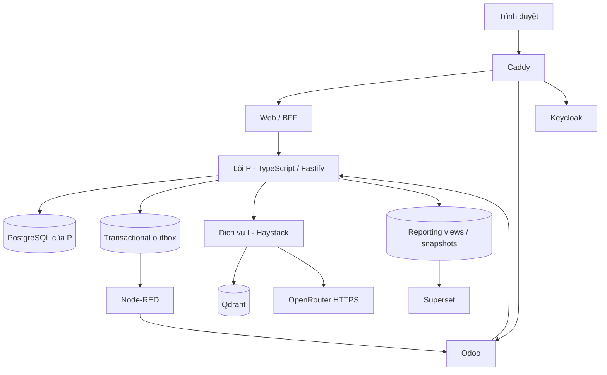

# Kiến trúc hệ điều hành doanh nghiệp số DX-LAB

> **Nguồn chuẩn:** [Architecture Spine](../../_bmad-output/planning-artifacts/architecture/architecture-DX-LAB-2026-09-19/ARCHITECTURE-SPINE.md). Khi tài liệu này khác với Architecture Spine, Architecture Spine được ưu tiên.

## 1. Trạng thái tài liệu

Repository hiện là một **brownfield skeleton**. Một số thư mục và cấu hình vẫn phản ánh kiến trúc thử nghiệm cũ, trong đó Node-RED nằm tại `services/p_process` và nhiều dịch vụ mở cổng trực tiếp. Đây không phải kiến trúc đích và không được dùng làm căn cứ để bổ sung nghiệp vụ mới.

Story 1.1 và 1.2 sẽ chuyển skeleton sang cấu trúc chuẩn được mô tả dưới đây.

## 2. Nguyên tắc kiến trúc

DX-LAB dùng kiến trúc lục giác cho lõi quy trình và tích hợp hướng sự kiện:

- Chỉ command của P được thay đổi ticket, phân công, bước quy trình, SLA, CSAT, khuyến nghị và vòng đời SOP.
- Tích hợp chỉ gọi API của P hoặc phản ứng với sự kiện đã commit; không thành phần nào ghi trực tiếp bảng riêng của P.
- Hợp đồng OpenAPI và JSON Schema trong `contracts/` là nguồn giao diện duy nhất sau khi Story 1.1 tạo cấu trúc này.
- Caddy là điểm vào công khai duy nhất. Các API đặc quyền và dịch vụ dữ liệu nằm trong mạng riêng.

## 3. Trách nhiệm các không gian H–P–D–I

### H — Con người và môi trường làm việc

Odoo Community cung cấp giao diện làm việc của nhân viên, nhắn tin và duyệt bản nháp SOP. Odoo chỉ lưu projection tối thiểu và tham chiếu tích hợp. Mọi hành động nghiệp vụ gọi command của P; chỉ P ghi nhận phê duyệt và xuất bản.

Keycloak là nhà phát hành danh tính OIDC duy nhất. P kiểm tra vai trò, nhóm và quyền trên từng tài nguyên. Nhân viên chỉ xem ticket thuộc nhóm và chịu trách nhiệm với ticket đã nhận; trưởng phòng và giám đốc có phạm vi được cấp rõ ràng.

### P — Lõi quy trình nghiệp vụ

`services/p_process` sẽ chứa lõi TypeScript/Fastify theo kiến trúc lục giác. Lõi này sở hữu:

- xác thực đầu vào và các bất biến nghiệp vụ;
- phân công công bằng, chuyển trạng thái và SLA theo giờ làm việc;
- CSAT, khuyến nghị, duyệt và xuất bản SOP;
- outbox giao dịch, audit log, reporting view và snapshot hằng ngày;
- vòng đời bất đồng bộ của công việc AI.

`services/p_automation` sẽ chứa Node-RED. Node-RED chỉ lập lịch và chuyển giao tích hợp; không chứa quy tắc nghiệp vụ, không quyết định trạng thái và không ghi bảng của P.

### D — Dữ liệu và phân tích

PostgreSQL có cơ sở dữ liệu và tài khoản tối thiểu riêng cho P, Odoo, Keycloak và metadata Superset. P sở hữu schema chuẩn, reporting view có phiên bản và snapshot hằng ngày. Superset chỉ đọc tập dữ liệu báo cáo đã giới hạn phạm vi; bộ lọc giao diện không thay thế kiểm soát quyền.

### I — Trí tuệ hỗ trợ quyết định

Haystack điều phối phân loại và phân tích bằng Qdrant cùng OpenRouter. I chỉ nhận dữ liệu đã giảm thiểu hoặc che thông tin theo mục đích. Request bật ZDR, từ chối thu thập dữ liệu và dùng model cố định `qwen/qwen3-8b`. I trả đề xuất có kiểu dữ liệu và bằng chứng; không được đổi ticket, gửi thông báo, phê duyệt hay xuất bản SOP.

P quản lý trạng thái công việc AI gồm `QUEUED`, `RUNNING`, `SUCCEEDED`, `FAILED`, `EXPIRED` và `SUPERSEDED`. Nhân viên xác nhận phân loại trước khi thay đổi có hiệu lực; giám đốc quyết định có áp dụng khuyến nghị hay không.

## 4. Luồng tích hợp chuẩn

1. Web hoặc Odoo gửi command đã xác thực tới P.
2. P kiểm tra quyền và bất biến, rồi ghi thay đổi cùng sự kiện outbox trong một giao dịch.
3. Worker của P chuyển sự kiện đã commit tới webhook Node-RED có phiên bản.
4. Node-RED chuyển sự kiện tới endpoint Odoo có phiên bản.
5. Odoo ghi durable inbox cùng projection rồi trả `2xx`; phản hồi này được chuyển lại làm xác nhận giao hàng.
6. Consumer khử trùng bằng `event_id`, bỏ qua phiên bản cũ và yêu cầu đồng bộ lại khi phát hiện khoảng trống phiên bản.

## 5. Ranh giới triển khai và bảo mật

- Web/BFF dùng phiên đăng nhập dạng cookie `Secure`, `HttpOnly`, `SameSite=Lax` chỉ chứa mã phiên mờ đã ký; token tái sử dụng nằm phía máy chủ. Mọi mutation xác thực bằng cookie phải chống CSRF.
- Odoo dùng OAuth 2.0 Token Exchange cho hành động của người dùng; tác vụ máy dùng client credentials.
- PostgreSQL, API nội bộ P, Node-RED editor, Superset admin, Keycloak admin, Qdrant và I không mở trực tiếp ra mạng công khai. Chỉ backend I được phép egress HTTPS tới OpenRouter.
- Không dùng mật khẩu mặc định, wildcard CORS, tag `latest`, model alias trôi nổi hoặc image chưa ghim digest trong bản phát hành.
- Log không chứa nội dung khách hàng, thân tệp, token hoặc prompt.

## 6. Chuyển đổi từ skeleton hiện tại

Story 1.1–1.2 phải thực hiện theo thứ tự:

1. Lập inventory schema, dữ liệu, chủ sở hữu và phụ thuộc của skeleton trước khi di chuyển.
2. Di chuyển tài sản Node-RED từ `services/p_process` sang `services/p_automation`.
3. Tạo lõi Fastify tại `services/p_process`, cùng `apps/web`, `contracts/` và `infra/`.
4. Chuyển schema được giữ lại bằng migration P có phiên bản và kiểm thử; không tạo sớm bảng ticket, phân công, workflow, CSAT hoặc SOP trước story sở hữu nhu cầu đó.
5. Tách database/user, mạng và profile Compose; bổ sung Caddy và Keycloak.
6. Nâng Node-RED và Superset theo phiên bản seed đã xác minh.
7. Sinh lockfile, ghim image digest, OCA commit và model manifest trước khi chấp nhận phát hành.

Danh sách phiên bản seed và bằng chứng cần khóa nằm trong [Technology Sources](../../_bmad-output/planning-artifacts/architecture/architecture-DX-LAB-2026-09-19/TECHNOLOGY-SOURCES.md).
